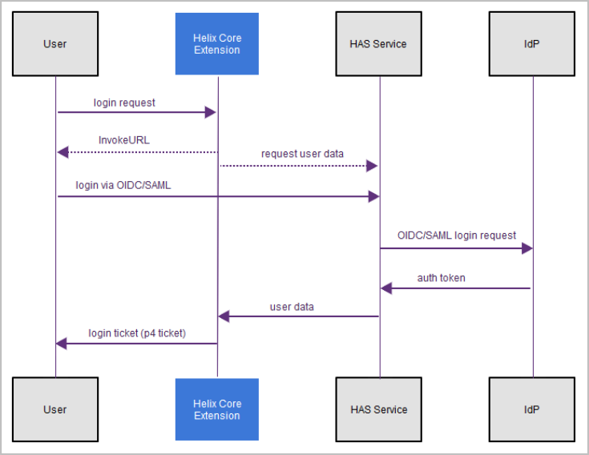

# Architecture

This document is intended for developers who are interested in the inner workings of the Helix Authentication Extension.

## Overview

The authentication extension is a Helix Core Server extension that hooks into the `auth-pre-sso` and `auth-check-sso` entry points. To facilitate web-based Single-Sign-On (SSO) functionality the extension connects to the Helix Authentication Service via HTTP/S. The extension has no dependencies aside from what Helix Core Server already provides, namely curl, JSON, and SSL support.

The overall flow of the authentication process is shown in the image below.

In detail, the following steps are performed:

1. The user invokes the `login` command from a supported P4 client.
1. Helix Core Server invokes the extension `auth-pre-sso` hook.
1. The extension asks the service to start a new login request via the `/requests/new` route.
1. The service responds with a JSON result containing the `loginUrl` for the request.
1. The extension emits the `loginUrl` to Helix Core Server.
1. Helix Core Server delivers the `loginUrl` to the user. In most cases, the user's desktop browser will be opened automatically.
1. Helix Core Server invokes the extension `auth-check-sso` hook.
1. The extension asks the service for the result of the login request via the `/requests/status` route. The service will not respond until the user successfully authenticates, or a timeout occurs.
1. During this time the user will authenticate with the identity provider and the service will receive the result.
1. The service responds to the `/requests/status` request from the extension with the user data (or an HTTP `408 Timeout` if the login timed out).
1. The extension compares the received user data with the user spec and determines if the user should be issued a ticket or not.
1. Helix Core Server either issues a ticket or indicates login failure.
